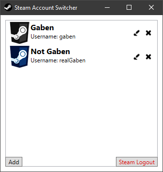

# Steam Account Switcher

SteamAccountSwitcher is a Windows application for easy switching between Steam accounts

## Features

This is a fork of the [original project by W3D3](https://github.com/W3D3/SteamAccountSwitcher). New features include:

- Portable
- No encryption
- Store settings in working directory
- JSON instead of XML
- Code cleanup
- Upgraded to .NET 4.8

## Screenshot

## Download
Check out the `Releases` page

## Credit

- [BoneyardBrew for the application icon](http://boneyardbrew.deviantart.com/art/Modern-Steam-Icon-421263397)
- [SimekOneLove for the account icons](http://www.iconarchive.com/artist/simekonelove.html)

## License

[CC Attribution-Share Alike 3.0](http://creativecommons.org/licenses/by-sa/3.0/)
